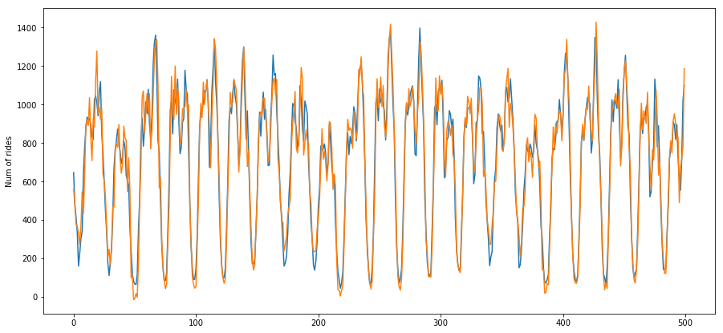

# Taxi
## Problem
Predict the number of trips in the next hours in each area of New York. In order to solve it, the raw data must be aggregated by hours and regions. The aggregated data will be hourly time series with the number of trips from each area.

## Solution
[Taxi solution](taxi.ipynb)

## Result
Actual and predicted rides by hour

